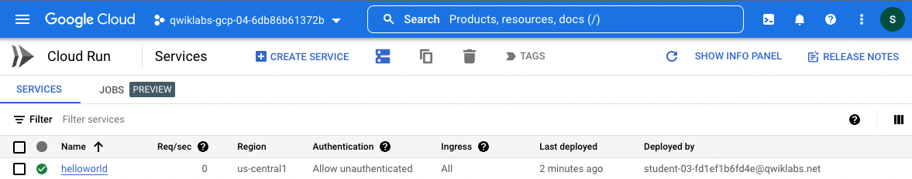

# Objectives

- Enable the Cloud Run API.
- Create a simple Node.js application that can be deployed as a serverless, stateless container.
- Containerize your application and upload to Container Registry (now called "Artifact Registry.")
- Deploy a containerized application on Cloud Run.
- Delete unneeded images to avoid incurring extra storage charges.

# Task 1: Enable the Cloud Run API and configure your Shell environment

1. From Cloud Shell, enable the Cloud Run API:

```bash
gcloud services enable run.googleapis.com
```

2. If you are asked to authorize the use of your credentials, do so. You should then see a successful message similar to this one:

```bash
Operation "operations/acf.cc11852d-40af-47ad-9d59-477a12847c9e" finished successfully.
```

> **Note**: You can also enable the API using the APIs & Services section of the console.

3. Set the compute region:

```bash
gcloud config set compute/region "us-central1"
```

4. Create a LOCATION environment variable:

```bash
export LOCATION="us-central1"
```

# Task 2: Write the sample application (Express.js)

In this task, you will build a simple express-based NodeJS application which responds to HTTP requests.

1. In Cloud Shell create a new directory named `helloworld`, then move your view into that directory:

```bash
mkdir helloworld && cd helloworld
```

2. Next you'll be creating and editing files. To edit files, use `nano` or the Cloud Shell Code Editor by clicking on the Open Editor button in Cloud Shell.

3. Create a `package.json` file, then add the following content to it:

```bash
nano package.json
```

```json
{
  "name": "helloworld",
  "description": "Simple hello world sample in Node",
  "version": "1.0.0",
  "main": "index.js",
  "scripts": {
    "start": "node index.js"
  },
  "author": "Google LLC",
  "license": "Apache-2.0",
  "dependencies": {
    "express": "^4.17.1"
  }
}
```

Most importantly, the file above contains a start script command and a dependency on the Express web application framework.

4. Press `CTRL` + `X`, then `Y`, then `Enter` to save the `package.json` file.

5. Next, in the same directory, create a `index.js` file, and copy the following lines into it:

```bash
nano index.js
```

```js
const express = require("express");
const app = express();
const port = process.env.PORT || 8080;

app.get("/", (req, res) => {
  const name = process.env.NAME || "World";
  res.send(`Hello ${name}!`);
});

app.listen(port, () => {
  console.log(`helloworld: listening on port ${port}`);
});
```

This code creates a basic web server that listens on the port defined by the PORT environment variable. Your app is now finished and ready to be containerized and uploaded to Container Registry.

6. Press `CTRL` + `X`, then `Y`, then `Enter` to save the `index.js` file.

# Task 3: Containerize your app and upload it to Artifact Registry

1. To containerize the sample app, create a new file named `Dockerfile` in the same directory as the source files, and add the following content:

```bash
nano Dockerfile
```

```bash
# Use the official lightweight Node.js 12 image.
# https://hub.docker.com/_/node
FROM node:12-slim

# Create and change to the app directory.
WORKDIR /usr/src/app

# Copy application dependency manifests to the container image.
# A wildcard is used to ensure copying both package.json AND package-lock.json (when available).
# Copying this first prevents re-running npm install on every code change.
COPY package*.json ./

# Install production dependencies.
# If you add a package-lock.json, speed your build by switching to 'npm ci'.
# RUN npm ci --only=production
RUN npm install --only=production

# Copy local code to the container image.
COPY . ./

# Run the web service on container startup.
CMD [ "npm", "start" ]
```

2. Press `CTRL` + `X`, then `Y`, then `Enter` to save the `Dockerfile` file.

3. Now, build your container image using Cloud Build by running the following command from the directory containing the `Dockerfile`. (Note the `$GOOGLE_CLOUD_PROJECT` environmental variable in the command, which contains your lab's Project ID):

```bash
gcloud builds submit --tag gcr.io/$GOOGLE_CLOUD_PROJECT/helloworld
```

Cloud Build is a service that executes your builds on GCP. It executes a series of build steps, where each build step is run in a Docker container to produce your application container (or other artifacts) and push it to Cloud Registry, all in one command.

Once pushed to the registry, you will see a SUCCESS message containing the image name (`gcr.io/[PROJECT-ID]/helloworld`). The image is stored in Artifact Registry and can be re-used if desired.

4. List all the container images associated with your current project using this command:

```bash
gcloud container images list
```

5. Register `gcloud` as the credential helper for all Google-supported Docker registries:

```bash
gcloud auth configure-docker
```

> **Note**: You may be prompted Do you want to continue? (y/N)? if you are, enter Y to agree.

6. To run and test the application locally from Cloud Shell, start it using this standard `docker` command:

```bash
docker run -d -p 8080:8080 gcr.io/$GOOGLE_CLOUD_PROJECT/helloworld
```

7. In the Cloud Shell window, click on `Web preview` and select `Preview on port 8080`.

This should open a browser window showing the "Hello World!" message. You could also simply use

```bash
curl localhost:8080
```

# Task 4: Deploy to Cloud Run

1. Deploying your containerized application to Cloud Run is done using the following command adding your Project-ID:

```bash
gcloud run deploy --image gcr.io/$GOOGLE_CLOUD_PROJECT/helloworld --allow-unauthenticated --region=$LOCATION
```

The allow-unauthenticated flag in the command above makes your service publicly accessible.

2. When prompted confirm the `service name` by pressing Enter.

> **Note**: Note: You may be prompted Do you want enable these APIs to continue (this will take a few minutes)? (y/N)? if you are, enter Y to enable the API needed.

Wait a few moments until the deployment is complete.

On success, the command line displays the service URL:

```bash
Service [helloworld] revision [helloworld-00001-xit] has been deployed
and is serving 100 percent of traffic.

Service URL: https://helloworld-h6cp412q3a-uc.a.run.app
```

You can now visit your deployed container by opening the service URL in any browser window.

**Congratulations**! You have just deployed an application packaged in a container image to Cloud Run. Cloud Run automatically and horizontally scales your container image to handle the received requests, then scales down when demand decreases. In your own environment, you only pay for the CPU, memory, and networking consumed during request handling.

For this lab you used the `gcloud` command-line. Cloud Run is also available via Cloud Console.

- From the `Navigation menu`, in the Serverless section, click `Cloud Run` and you should see your `helloworld` service listed:



# Task 5: Clean up

While Cloud Run does not charge when the service is not in use, you might still be charged for storing the built container image.

1. You can either decide to delete your GCP project to avoid incurring charges, which will stop billing for all the resources used within that project, or simply delete your `helloworld` image using this command:

```bash
gcloud container images delete gcr.io/$GOOGLE_CLOUD_PROJECT/helloworld
```

2. When prompted to continue type `Y`, and press `Enter`.

3. To delete the Cloud Run service, use this command:

```bash
gcloud run services delete helloworld --region="REGION"
```

4. When prompted to continue type `Y`, and press `Enter`.
